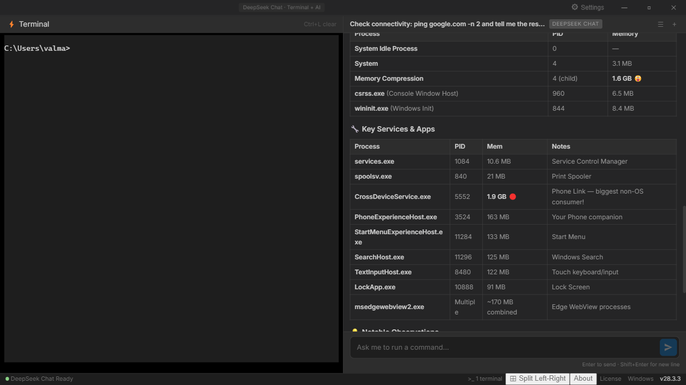
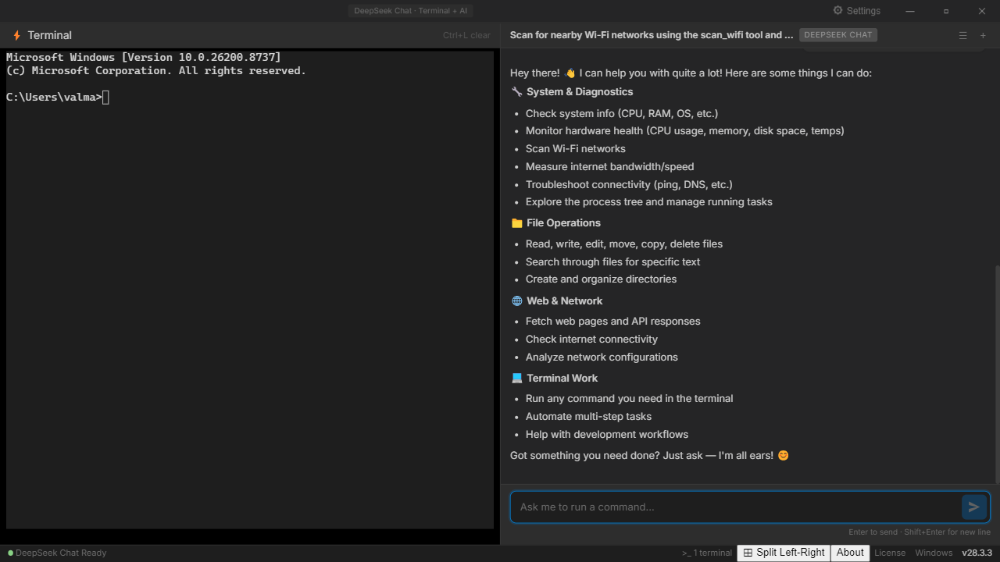
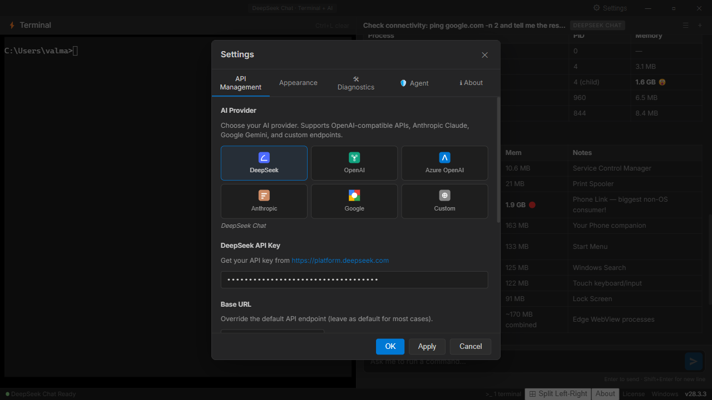
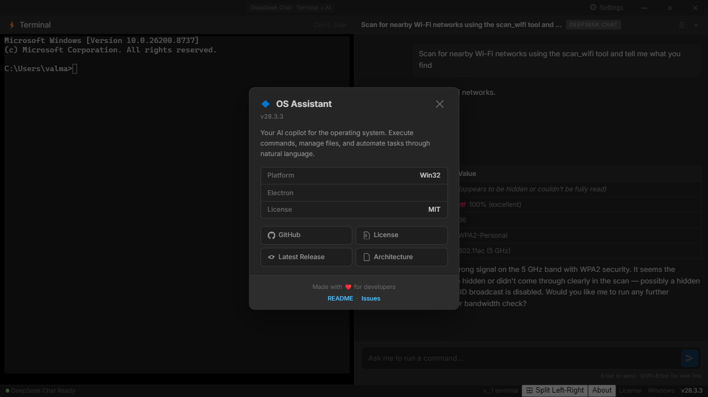
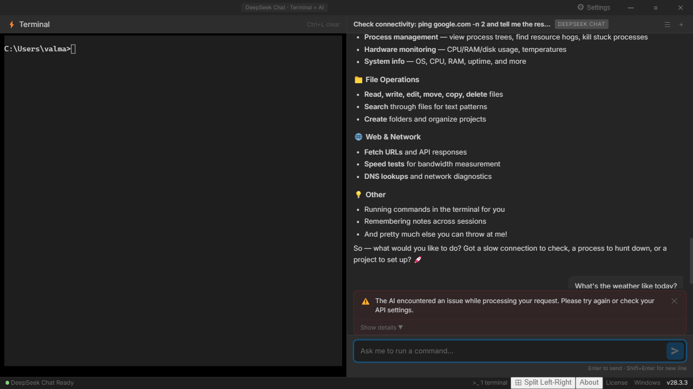

# ◆ OS Assistant

> **Your AI assistant for the operating system.** A transparent operator machine where the AI runs commands in your visible terminal — safety through visibility, not restriction.

[](https://github.com/valmapaura/terminalAi/releases/latest)
[](LICENSE)
[](https://github.com/valmapaura/terminalAi/actions/workflows/ci.yml)

> **🧑‍💻 Maintainer status:** This is a **spare-time project**. Contributions, issues, and PRs are reviewed when time allows. See [CONTRIBUTING.md](CONTRIBUTING.md) for details.

---

## ⚠️ Disclaimer — Read Before Using

**OS Assistant is experimental software.** An AI with terminal access is a powerful tool — and it can cause real damage if misused. Please understand the risks before using it.

**The AI is not your property.** OS Assistant is a shell that lets _you_ plug in an AI provider (DeepSeek, OpenAI, Anthropic, etc.). The quality, safety, and behavior of the AI depends entirely on the provider and model you choose. I do not control, endorse, or guarantee any AI's output.

**You are responsible for your own safety.** The AI operates in your visible terminal by default — commands run on your actual machine with your permissions. Always watch what it's doing. Do not leave it unattended. Do not give it access to sensitive systems without supervision.

**Things that can go wrong:**

- The AI may misinterpret your request and run a destructive command (`rm -rf`, `format`, `diskpart`, etc.)
- The AI may expose personal data it reads from your system
- The AI may have security vulnerabilities depending on the provider/model
- The app itself may have bugs — it's a spare-time project

**By using this software, you accept these risks.** If that doesn't sound right for you, that's completely fair — please don't use it.

---

## Screenshots

|               Main UI               |              AI Chat in Action              |
| :---------------------------------: | :-----------------------------------------: |
|  |    |
|  _Split-screen terminal + AI chat_  | _AI assistant responding with tool calling_ |

|               Settings Panel                |              About Dialog              |
| :-----------------------------------------: | :------------------------------------: |
|  |  |
|     _Multi-provider API configuration_      |          _App info and links_          |

|                          Weather Query                           |
| :--------------------------------------------------------------: |
|                      |
| _AI answering "What's the weather?" — location detection + curl_ |

---

## Features

| Feature                       | Description                                                                                                                      |
| ----------------------------- | -------------------------------------------------------------------------------------------------------------------------------- |
| **Split‑Screen Layout**       | Resizable terminal and chat panes (horizontal or vertical)                                                                       |
| **Terminal Pane**             | Windows CMD via `node-pty` + `xterm.js`                                                                                          |
| **AI Chat**                   | Streaming AI assistant with tool calling — run commands, read output, help you script                                            |
| **Multi-Provider**            | DeepSeek, OpenAI, Azure OpenAI, Anthropic Claude, Google Gemini, or any OpenAI-compatible endpoint                               |
| **Command Injection**         | AI suggests commands → preview → accept/reject before execution                                                                  |
| **Safety Through Visibility** | AI operates in your visible terminal — you watch every command in real-time. Danger preview as a supplement, not the foundation. |
| **4 VS Code Themes**          | Dark Modern, Light Modern, Solarized Dark, Solarized Light — with matching xterm terminal colors                                 |
| **Encrypted Keys**            | API keys encrypted at rest via Electron `safeStorage` (Windows Credential Manager)                                               |

### Supported AI Providers

| Provider      | Default Model      | Streaming | Tool Calling |
| ------------- | ------------------ | --------- | ------------ |
| DeepSeek      | `deepseek-chat`    | ✅        | ✅           |
| OpenAI        | `gpt-4o`           | ✅        | ✅           |
| Azure OpenAI  | `gpt-4o`           | ✅        | ✅           |
| Anthropic     | `claude-sonnet-4`  | ✅        | ✅           |
| Google Gemini | `gemini-2.0-flash` | ✅        | ✅           |
| Custom (any)  | configurable       | ✅        | ✅           |

### Tech Stack

| Layer         | Technology                                                                           |
| ------------- | ------------------------------------------------------------------------------------ |
| **Framework** | [Electron](https://www.electronjs.org/) 28+                                          |
| **Terminal**  | [xterm.js](https://xtermjs.org/) + [node-pty](https://github.com/microsoft/node-pty) |
| **Frontend**  | [React](https://react.dev/) 18 + TypeScript                                          |
| **Build**     | Webpack 5 + Electron Builder                                                         |
| **Security**  | `safeStorage` encryption, `contextIsolation`, CSP                                    |

---

## � Download (No Coding Required)

> **⬇️ [Download the latest installer](https://github.com/valmapaura/terminalAi/releases/latest)** — no Node.js, no terminal, no coding needed. Just download and run.

1. Go to **[Releases](https://github.com/valmapaura/terminalAi/releases)**
2. Download the latest `OS Assistant Setup X.X.X.exe`
3. Run the installer — launch the app from your Start Menu or Desktop shortcut
4. Click **⚙️ Settings** (or press `Ctrl+,`) to enter your API key
5. Start chatting!

---

## 🔑 Getting an API Key (Step-by-Step)

OS Assistant needs an API key from an AI provider to work. Here's how to get one for free or cheap:

<details>
<summary><b>🟢 DeepSeek (cheapest — recommended)</b></summary>

1. Go to **[platform.deepseek.com](https://platform.deepseek.com)** and sign up
2. Go to **API Keys** in the left sidebar
3. Click **Create API Key** — give it a name like "os-assistant"
4. Copy the key and paste it into OS Assistant's settings
5. Top up with a few dollars — DeepSeek is extremely cheap (~$0.14 per million tokens)

</details>

<details>
<summary><b>🔵 OpenAI</b></summary>

1. Go to **[platform.openai.com](https://platform.openai.com)** and sign up
2. Go to **API Keys** → **Create new secret key**
3. Copy the key starting with `sk-...`
4. Paste it into OS Assistant settings
5. Add **billing** (credit card) at [billing.openai.com](https://billing.openai.com) — usage is pay-as-you-go

</details>

<details>
<summary><b>🟠 Anthropic Claude</b></summary>

1. Go to **[console.anthropic.com](https://console.anthropic.com)** and sign up
2. Go to **API Keys** → **Create API Key**
3. Copy the key starting with `sk-ant-...`
4. Paste it into OS Assistant settings
5. Add billing info to start using it

</details>

<details>
<summary><b>💜 Google Gemini</b></summary>

1. Go to **[aistudio.google.com](https://aistudio.google.com)** and sign in
2. Click **Get API Key** in the left sidebar
3. Click **Create API Key** — you can use an existing Google Cloud project or create one
4. Copy the key and paste it into OS Assistant settings
5. Google offers a **free tier** with generous usage limits!

</details>

<details>
<summary><b>⚫ Azure OpenAI</b></summary>

1. You need an **Azure subscription** — go to [portal.azure.com](https://portal.azure.com)
2. Create an **Azure OpenAI Service** resource
3. Deploy a model (e.g. `gpt-4o`) in **Azure AI Foundry**
4. Get the **Endpoint URL** and **API Key** from the resource's **Keys and Endpoint** page
5. In OS Assistant, select **Azure OpenAI**, enter both the endpoint URL and key

</details>

<details>
<summary><b>🟣 Custom (Local / Self-Hosted)</b></summary>

1. If you run a local model (e.g. Ollama, LocalAI, vLLM), use **Custom (OpenAI-Compatible)**
2. Set the base URL to your server (e.g. `http://localhost:11434/v1`)
3. API key is optional for local servers

</details>

---

## 🛠️ Build from Source (For Developers)

If you'd rather build it yourself:

### Prerequisites

- [Node.js](https://nodejs.org/) 18+
- [Python](https://www.python.org/) (required for `node-pty` build on Windows)

```bash
git clone https://github.com/valmapaura/terminalAi.git
cd terminalAi
npm install
npm run build
npm start
```

### First Launch (Source Build)

1. The app opens with a terminal (left) and chat (right)
2. Click **⚙️ Settings** (or press `Ctrl+,`)
3. Pick your AI provider and paste your API key
4. Start chatting — the AI can run commands, read terminal output, and help you script

---

## Usage

- **`Ctrl+,`** — Toggle settings
- **`Escape`** — Close command preview / settings
- **`Ctrl+L`** — Clear terminal
- Type in chat → AI responds with code blocks → click **⚡ Run** to execute
- Sandbox mode previews all commands before execution (enabled by default)

---

## Project Structure

```
os-assistant/
├── src/
│   ├── main/                 # Electron main process
│   │   ├── main.ts           # App entry, frameless window
│   │   ├── terminal.ts       # node-pty terminal manager
│   │   └── ipc-handlers.ts   # IPC + encrypted provider config
│   ├── preload/
│   │   └── preload.ts        # Context bridge (terminal, provider, window controls)
│   └── renderer/
│       ├── App.tsx            # Root — menu bar, split pane, status bar
│       ├── components/
│       │   ├── SplitPane.tsx      # Resizable split
│       │   ├── TerminalPane.tsx   # xterm.js wrapper
│       │   ├── ChatPane.tsx       # AI chat + API setup prompt
│       │   ├── SettingsPanel.tsx  # Provider config UI
│       │   └── CommandPreview.tsx # Pre-execution preview
│       ├── hooks/
│       │   ├── useTerminal.ts     # Terminal lifecycle
│       │   └── useDeepSeek.ts     # Multi-provider AI hook
│       ├── utils/
│       │   ├── deepseek-api.ts    # Universal streaming client
│       │   └── command-validator.ts
│       └── styles/
│           └── app.css
└── package.json
```

---

## Development

```bash
npm run dev     # Watch mode — auto-rebuild on changes
npm run build   # Production build
npm run dist    # Package installer
```

---

## Vision

OS Assistant is not just a terminal tool. It is a step toward an **Operating System Assistant** — an AI that understands and operates your machine the way a human would.

### The Long-Term Goal

We envision an AI that can:

- **Navigate any desktop application** — click buttons, fill forms, read UI elements, and perform multi-step workflows across any Windows application, not just the terminal.
- **Understand system state holistically** — monitor processes, services, event logs, network connections, and disk activity to give you a complete picture of what your computer is doing.
- **Automate complex OS tasks** — install software, configure system settings, manage users, troubleshoot drivers, and orchestrate multi-tool workflows without requiring custom scripting.
- **Learn from your patterns** — remember how you like your system configured, anticipate maintenance needs, and proactively suggest optimizations.
- **Cross-platform parity** — deliver the same deep integration on macOS and Linux, adapting to each platform's unique APIs and conventions.
- **Operate with transparency and safety** — always show what it intends to do, ask for confirmation on destructive actions, and let you audit every decision it made.

### Why This Matters

The terminal is the most powerful interface to a computer — but it has a steep learning curve. GUIs are accessible but limit what you can express. OS Assistant bridges the gap: it lets you express intent in natural language and translates that into precise, safe, multi-step operations across the full breadth of your operating system.

We start with the terminal because it is the most direct, most capable interface to the machine. From there, we expand to window management, application control, and eventually full OS orchestration — all while keeping you in control.

> **Today: A terminal AI that runs commands. Tomorrow: An AI that runs your computer — with your permission.**

---

## Security

- API keys encrypted at rest via Electron `safeStorage` (Windows Credential Manager)
- Commands validated before injection into the terminal
- Dangerous commands always require user confirmation
- Sandbox mode prevents any execution without preview
- CSP headers restrict renderer connectivity

---

## License

MIT

---

## 🙌 Contributing

Contributions are welcome! This project is structured to grow:

1. Fork the repo
2. Create a feature branch
3. Make your changes
4. Submit a PR

See the [Roadmap](#roadmap) for planned features.
